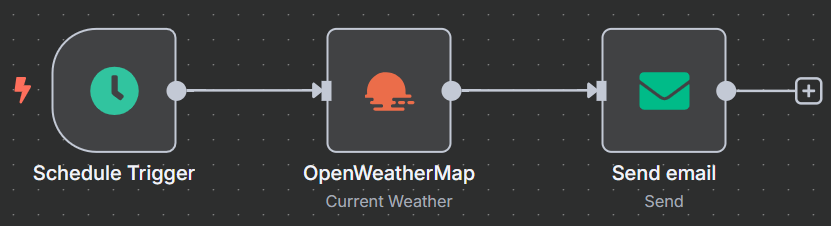

# ☀️ n8n Workflow: Daily Weather Forecast Email

This n8n workflow automates sending a daily weather forecast summary to your email. It fetches weather data for a specified location and delivers a neatly formatted email on a set schedule.

---

## 🧠 Workflow Overview

The workflow performs the following:

- Triggers automatically on a defined schedule (e.g., every morning at 7:00 AM).
- Fetches the current weather forecast for a specified city using OpenWeatherMap.
- Compiles the forecast into a readable summary.
- Sends the summary to your email address.

---

### 📊 Workflow Diagram



---

## 🧱 Workflow Structure

This workflow consists of the following nodes:

1.  **Schedule Trigger** – Initiates the workflow on a schedule
2.  **OpenWeatherMap** – Fetches weather forecast data
3.  **Send Email** – Sends the formatted weather summary via email

---

## 🔍 Node Details

### 1. Schedule Trigger (Trigger Node)

*   **Node Name:** `Schedule Trigger`
*   **Type:** `n8n-nodes-base.scheduleTrigger`
*   **Purpose:** Starts the workflow automatically at a predefined time.
*   **Configuration:**
    *   **Mode:** `everyDay`
    *   **Hour:** `7` (for 7:00 AM)
    *   **Minute:** `0` (for 7:00 AM)

---

### 2. OpenWeatherMap (Action Node)

*   **Node Name:** `OpenWeatherMap`
*   **Type:** `n8n-nodes-base.openWeatherMap`
*   **Purpose:** Retrieves weather forecast data from the OpenWeatherMap API.
*   **Configuration:**
    *   **Operation:** `5DayForecast` - Fetches a 5-day weather forecast.
    *   **Location Selection:** `cityName`
    *   **City Name:** `London` (You can change this to your desired city, e.g., "New York", "Tokyo")
    *   **Format:** `metric` (e.g., Celsius for temperature)
    *   **Credentials:** `OpenWeatherMap API` - Requires an API key from OpenWeatherMap, configured as a credential in n8n.

---

### 3. Send Email (Action Node)

*   **Node Name:** `Send Email`
*   **Type:** `n8n-nodes-base.emailSend`
*   **Purpose:** Sends the compiled weather forecast as an email.
*   **Configuration:**
    *   **From Email:** `your_email@example.com` (Replace with your sender email address)
    *   **To Email:** `your_email@example.com` (Replace with your recipient email address)
    *   **Subject:** `Daily Weather Forecast for London` (Dynamically includes the city name)
    *   **Message:**
        ```
        Daily Weather Forecast for London:

        {{ $node["OpenWeatherMap"].json["list"].map(item => "Date: " + new Date(item.dt * 1000).toLocaleDateString() + ", Temp: " + item.main.temp + "°C, Description: " + item.weather[0].description).join("\n") }}
        ```
        This expression iterates through the forecast data from the `OpenWeatherMap` node and formats it into a readable list, showing the date, temperature, and description for each forecast entry.
    *   **Credentials:** `SMTP Account` - Requires SMTP server credentials (host, port, username, password) configured in n8n.

---

## 🔗 Workflow Logic

1.  The `Schedule Trigger` node activates the workflow at the configured time (e.g., daily at 7:00 AM).
2.  The `OpenWeatherMap` node then executes, fetching the 5-day weather forecast for the specified city.
3.  The weather data is passed to the `Send Email` node.
4.  The `Send Email` node uses an expression to extract and format the relevant weather details into a clear message.
5.  Finally, the formatted weather summary is sent to the specified email address.

---

## ⚙️ Prerequisites

To use this workflow, ensure the following:

### ✅ n8n Setup

*   A running n8n instance (cloud or self-hosted)

### ✅ OpenWeatherMap API Key

*   Obtain an API key from [OpenWeatherMap](https://openweathermap.org/api).
*   Add this API key as a credential in your n8n instance, named `OpenWeatherMap API`.

### ✅ SMTP Server Credentials

*   You need access to an SMTP server to send emails.
*   Configure your SMTP server details (host, port, username, password) as a credential in your n8n instance, named `SMTP Account`.

---

## 🚀 Deployment Instructions

1.  **Import** the [`daily_weather_workflow.json`](daily_weather_workflow.json) file into your n8n instance.
2.  **Connect Credentials**:
    *   Link the `OpenWeatherMap` node to your `OpenWeatherMap API` credential.
    *   Link the `Send Email` node to your `SMTP Account` credential.
3.  **Customize**:
    *   Adjust the `City Name` in the `OpenWeatherMap` node to your desired location.
    *   Update the `From Email` and `To Email` addresses in the `Send Email` node.
4.  **Activate** the workflow.

Once activated, n8n will automatically send you daily weather forecast emails at the scheduled time.

---

## 📄 File Reference

*   [`daily_weather_workflow.json`](daily_weather_workflow.json) – The n8n workflow export

---

## 📝 License

[MIT](LICENSE)