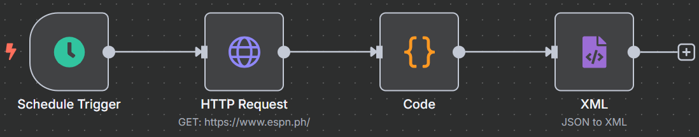

# 📰 n8n Workflow: ESPN RSS Feed Generator

This n8n workflow automates the process of fetching headlines and links from ESPN's homepage and generating a personal RSS feed. This allows you to consume ESPN headlines in any RSS feed reader.

---

## 🧠 Workflow Overview

The workflow performs the following:

- Triggers automatically on a defined schedule (e.g., every hour).
- Fetches the raw HTML content of ESPN's homepage (`https://www.espn.ph/`).
- Extracts headlines and their corresponding links from the HTML.
- Generates a valid RSS feed XML from the extracted data.

---

### 📊 Workflow Diagram



---

## 🧱 Workflow Structure

This workflow consists of the following nodes:

1.  **Schedule Trigger** – Initiates the workflow on a schedule
2.  **HTTP Request** – Fetches the raw HTML of ESPN's homepage
3.  **Code** – Parses the HTML to extract headlines and links
4.  **XML** – Converts the extracted data into RSS feed XML format

---

## 🔍 Node Details

### 1. Schedule Trigger (Trigger Node)

*   **Node Name:** `Schedule Trigger`
*   **Type:** `n8n-nodes-base.scheduleTrigger`
*   **Purpose:** Starts the workflow automatically at a predefined interval.
*   **Configuration:**
    *   **Interval:** `1h` (every hour)

---

### 2. HTTP Request (Action Node)

*   **Node Name:** `HTTP Request`
*   **Type:** `n8n-nodes-base.httpRequest`
*   **Purpose:** Retrieves the raw HTML content from the specified URL.
*   **Configuration:**
    *   **URL:** `https://www.espn.ph/`
    *   **Response Mode:** `response`
    *   **Full Response:** `true` (to get the raw HTML)
    *   **Options:** `encoding: utf8`

---

### 3. Code (Action Node)

*   **Node Name:** `Code`
*   **Type:** `n8n-nodes-base.code`
*   **Purpose:** Parses the HTML content to extract headlines and links using regular expressions, then formats them into a structure suitable for an RSS feed.
*   **Configuration:**
    *   **Language:** `JavaScript`
    *   **JS Code:**
        ```javascript
        const html = items[0].json.data;
        const headlines = [];
        const regex = /<h\d[^>]*>(.*?)<\/h\d>/g;
        let match;
        while ((match = regex.exec(html)) !== null) {
          headlines.push(match[1].trim());
        }

        const links = [];
        const linkRegex = /<a\s+(?:[^>]*?\s+)?href=(["'])(.*?)\1/g;
        while ((match = linkRegex.exec(html)) !== null) {
          links.push(match[2]);
        }

        const rssItems = headlines.map((headline, index) => ({
          title: headline,
          link: links[index] || 'https://www.espn.ph/',
          description: headline,
          pubDate: new Date().toUTCString()
        }));

        return [{ json: { rssItems } }];
        ```

---

### 4. XML (Action Node)

*   **Node Name:** `XML`
*   **Type:** `n8n-nodes-base.xml`
*   **Purpose:** Converts the structured JSON data into a valid RSS XML format.
*   **Configuration:**
    *   **Mode:** `jsonToxml`
    *   **Property Name:** `xml` (output property name for the XML string)
    *   **Options:**
        *   `rootName`: `rss` (sets the root element of the XML to `<rss>`)
        *   `cdata`: `true` (wraps content in CDATA sections)
        *   `headless`: `true` (removes the XML declaration `<?xml version="1.0" encoding="UTF-8"?>`)

---

## 🔗 Workflow Logic

1.  The `Schedule Trigger` node activates the workflow at the configured interval (e.g., hourly).
2.  The `HTTP Request` node fetches the raw HTML from ESPN's homepage.
3.  The `Code` node processes the HTML, extracting headlines and links, and structuring them into an array of RSS feed items.
4.  The `XML` node then takes these structured items and converts them into a complete RSS XML string.
5.  Once deployed and active, the RSS Feed node will provide a URL that can be used in any feed reader to subscribe to the generated headlines.

---

## ⚙️ Prerequisites

To use this workflow, ensure the following:

### ✅ n8n Setup

*   A running n8n instance (cloud or self-hosted)

---

## 🚀 Deployment Instructions

1.  **Import** the [`espn_rss_feed_workflow.json`](espn_rss_feed_workflow.json) file into your n8n instance.
2.  **Activate** the workflow.
3.  Once activated, the `XML` node (or a subsequent node if you add one to serve the RSS feed) will provide the generated RSS feed URL. You might need to configure a Webhook node after the XML node to expose the RSS feed publicly.

---

## 📄 File Reference

*   [`espn_rss_feed_workflow.json`](espn_rss_feed_workflow.json) – The n8n workflow export

---

## 📝 License

[MIT](LICENSE)