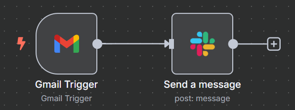

# n8n Workflow: Gmail to Slack Notification

Automate Slack notifications for new Gmail emails using n8n. This workflow monitors a Gmail inbox and posts formatted summaries of new emails into a specified Slack channel.

---

## 📌 Workflow Overview

This n8n workflow automates the process of notifying a Slack channel when a new email arrives in a specified Gmail inbox. It extracts key information (sender, subject, and snippet) and posts it as a formatted message.

---

### 🖼️ Workflow Diagram



---

## 🧩 Workflow Structure

The workflow consists of two main nodes:

1. **Gmail Trigger** – Monitors Gmail inbox for new emails  
2. **Slack** – Sends formatted message to a Slack channel

Data flows directly from the Gmail node into the Slack node.

---

## 🔍 Node Details

### 1. Gmail Trigger

- **Node Name:** `Gmail Trigger`
- **Type:** `n8n-nodes-base.gmailTrigger`
- **Function:** Triggers the workflow when a new email is received
- **Configuration:**
  - **Authentication:** OAuth2 (Google Cloud project required)
  - **Event:** `messageReceived`

### 2. Slack

- **Node Name:** `Slack`
- **Type:** `n8n-nodes-base.slack`
- **Function:** Sends message to a Slack channel
- **Configuration:**
  - **Resource:** `message`
  - **Operation:** `post`
  - **Channel ID:** `#general`
  - **Message Template:**
    ```
    New Email Received:
    Sender: {{ $json.from.emailAddress }}
    Subject: {{ $json.subject }}
    Snippet: {{ $json.snippet }}
    ```

---

## 🔗 Workflow Logic

1. Gmail Trigger detects a new email
2. Email data is passed as JSON to the Slack node
3. Slack node formats and sends the message to the specified channel

---

## ⚙️ Prerequisites

To run this workflow:

1. A running n8n instance (self-hosted or cloud)
2. **Gmail OAuth2 Credentials**  
   - Set up a Google Cloud project  
   - Enable Gmail API  
   - Generate OAuth client credentials

3. **Slack App Credentials**  
   - Create a Slack App  
   - Install it to your workspace  
   - Generate a Bot Token with `chat:write` permission

4. A valid Slack channel (e.g., `#general`) the bot can post to

---

## 🚀 Setup Instructions

1. **Import** `gmail_to_slack_workflow.json` into your n8n instance
2. **Connect Credentials** to the Gmail and Slack nodes
3. **Configure the Slack channel** if different from `#general`
4. **Activate** the workflow

Once activated, n8n will monitor your Gmail inbox and send real-time Slack notifications for new emails.

---

## 📁 File Reference

- [`gmail_to_slack_workflow.json`](gmail_to_slack_workflow.json) – The n8n workflow export

---

## 📝 License

[MIT](LICENSE)