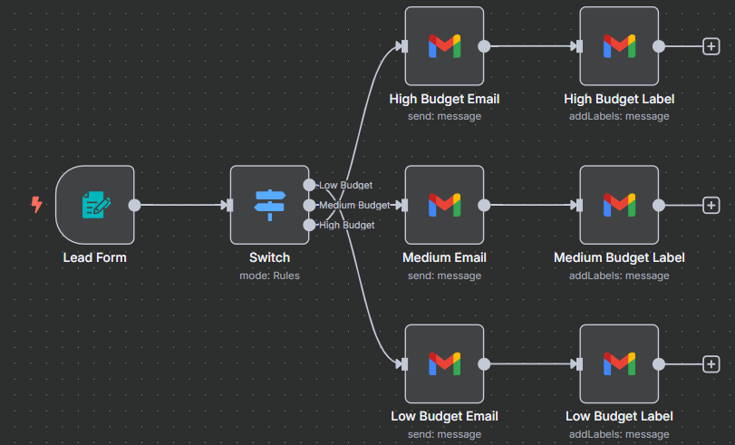

# 📩 n8n Workflow: Lead Form Automation

This n8n workflow automates the process of handling new lead submissions from a web form. Based on the project budget provided, it sends tailored email responses and applies appropriate labels in Gmail to help you prioritize and organize leads.

---

## 🧠 Workflow Overview

The workflow performs the following:

- Collects lead details via a web form
- Categorizes leads based on budget: Low, Medium, or High
- Sends a custom email based on the selected budget
- Applies corresponding Gmail labels for internal organization

---

### 📊 Workflow Diagram

---

## 🧱 Workflow Structure

This workflow consists of the following nodes:

1. **Lead Form** – Form Trigger Node  
2. **Switch** – Evaluates Project Budget  
3. **Budget-Based Email Nodes**:  
   - High Budget Email  
   - Medium Budget Email  
   - Low Budget Email  
4. **Budget-Based Gmail Label Nodes**:  
   - High Budget Label  
   - Medium Budget Label  
   - Low Budget Label  

---

## 🔍 Node Details

### 1. Lead Form (Trigger Node)

- **Type:** `n8n-nodes-base.formTrigger`
- **Form Title:** `Lead Form`
- **Purpose:** Captures user-submitted lead data and starts the workflow.
- **Fields:**
  - `Full Name` (Text)
  - `What project do you want automated?` (Textarea)
  - `Time Frame` (Dropdown): `1-3 months`, `3-6 months`, `6-9 months`
  - `Project Budget` (Dropdown): `$10 - $49`, `$50 - $199`, `$200 - $399`

---

### 2. Switch (Logic Node)

- **Type:** `n8n-nodes-base.switch`
- **Purpose:** Routes leads based on their selected project budget.
- **Conditions:**
  - `$10 - $49` → Low Budget
  - `$50 - $199` → Medium Budget
  - `$200 - $399` → High Budget

---

### 3. Budget Email Nodes (Gmail)

| Node Name             | Target Email           | Subject                              |
|-----------------------|------------------------|---------------------------------------|
| High Budget Email     | ipsum770@gmail.com     | `New Automation Lead: {{ $json["Full Name"] }}` |
| Medium Budget Email   | ipsum770@gmail.com     | `New Automation Lead: {{ $json["Full Name"] }}` |
| Low Budget Email      | ipsum770@gmail.com     | `New Automation Lead: {{ $json["Full Name"] }}` |

- **Type:** `n8n-nodes-base.gmail`
- **Email Type:** Plain text
- **Message Content Includes:**
  - Full Name
  - Project description
  - Time Frame
  - Project Budget
  - Submission Timestamp (`$json.submittedAt`)
- **Credentials:** Gmail OAuth2 (`Gmail account`)

---

### 4. Budget Label Nodes (Gmail)

| Node Name           | Label ID                    |
|---------------------|-----------------------------|
| High Budget Label   | `Label_677638601008717320`  |
| Medium Budget Label | `Label_7021340606924893343` |
| Low Budget Label    | `Label_3265145165866764487` |

- **Operation:** `addLabels`
- **Message ID:** `={{ $json.id }}`
- **Credentials:** Gmail OAuth2 (`Gmail account`)

---

## 🔗 Workflow Logic

1. A lead submits the web form.
2. The `Switch` node evaluates the submitted budget.
3. The workflow sends a tailored email to your team based on budget level.
4. The sent email is labeled in Gmail using the matching label node.

---

## ⚙️ Prerequisites

To use this workflow, ensure the following:

### ✅ n8n Setup

- A running n8n instance (cloud or self-hosted)

### ✅ Gmail Setup

- Google Cloud project with Gmail API enabled
- OAuth2 credentials added to n8n under "Gmail account"
- The following labels must be manually created in your Gmail account:
  - `Label_677638601008717320` (High Budget)
  - `Label_7021340606924893343` (Medium Budget)
  - `Label_3265145165866764487` (Low Budget)

---

## 🚀 Deployment Instructions

1. **Import** the [`lead_flow_workflow.json`](lead_flow_workflow.json) file into your n8n instance.
2. **Connect Credentials** to all Gmail nodes using the `Gmail account` credential.
3. **Activate** the workflow. The form will be accessible and functional immediately after activation.

---

## 📎 Additional Notes

- You can customize the email content and form fields as needed.
- Budget thresholds or labels can be modified in the Switch and Gmail nodes.
- Consider integrating a CRM step for better lead follow-up.

---

## 📄 File Reference

- [`lead_flow_workflow.json`](lead_flow_workflow.json) – Contains the full export of the automation

---

## 📝 License

[MIT](LICENSE)
