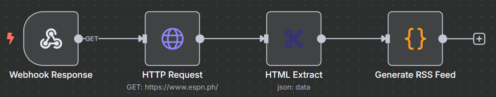

# 📰 n8n Workflow: Custom RSS Feed Generator for ESPN Site

This n8n workflow automates the process of generating a custom RSS 2.0 feed from the ESPN Philippines website. It fetches the website's content, extracts relevant information using CSS selectors, and serves it as an XML feed via a webhook.

---

## 🧠 Workflow Overview

The workflow performs the following:

-   Fetches the HTML content of `https://www.espn.ph/`.
-   Extracts article titles and links using specified CSS selectors.
-   Generates a standard RSS 2.0 XML feed from the extracted data.
-   Exposes the generated RSS feed via a public webhook URL.

---

### 📊 Workflow Diagram

---

## 🧱 Workflow Structure

This workflow consists of the following nodes:

1.  **HTTP Request** – Fetches the content of the target website.
2.  **HTML Extract** – Parses the HTML and extracts data using CSS selectors.
3.  **Generate RSS Feed** – A Code node that transforms the extracted data into an RSS XML feed.
4.  **Webhook Response** – Serves the generated RSS feed as an XML file.

---

## 🔍 Node Details

### 1. HTTP Request (Action Node)

*   **Node Name:** `HTTP Request`
*   **Type:** `n8n-nodes-base.httpRequest`
*   **Purpose:** Retrieves the HTML content from the specified URL.
*   **Configuration:**
    *   **URL:** `https://www.espn.ph/` (Can be changed to any target website)
    *   **Method:** `GET`
    *   **Response Format:** (Implicitly string, as HTML Extract expects string input)

---

### 2. HTML Extract (Action Node)

*   **Node Name:** `HTML Extract`
*   **Type:** `n8n-nodes-base.htmlExtract`
*   **Purpose:** Extracts specific data (titles and links) from the fetched HTML using CSS selectors.
*   **Configuration:**
    *   **Extraction Values:**
        *   `link`: `h2.contentItem__title a` (attribute `href`)
        *   `title`: `h2.contentItem__title` (text)
        *   `link`: `a[data-mpType="headline"]` (attribute `href`)
        *   `title`: `a[data-mpType="headline"]` (text)
    *   **Note:** These CSS selectors are specific to `https://www.espn.ph/`. If the website's structure changes, these selectors will need to be updated.

---

### 3. Generate RSS Feed (Code Node)

*   **Node Name:** `Generate RSS Feed`
*   **Type:** `n8n-nodes-base.code`
*   **Purpose:** Processes the extracted titles and links to construct a valid RSS 2.0 XML feed.
*   **Configuration:** Contains JavaScript code that iterates through the input data and formats it into RSS `<item>` elements, then wraps them in the complete RSS XML structure. (Note: The provided JSON for this workflow has placeholder code; ensure it's updated with the actual RSS generation logic).

---

### 4. Webhook Response (Action Node)

*   **Node Name:** `Webhook Response`
*   **Type:** `n8n-nodes-base.webhook`
*   **Purpose:** Exposes the generated RSS feed via a public webhook URL.
*   **Configuration:**
    *   **Path:** `rss` (The full webhook URL will be `YOUR_N8N_URL/webhook/rss`)
    *   **Response Mode:** `lastNode`
    *   **Response Data:** (Implicitly `binary` from the previous node's output)
    *   **Options:** (Implicitly `responseContentType: application/xml` from the previous node's output)
    *   **Note:** The connection in the provided JSON for this workflow shows `Webhook Response` connected to `HTTP Request`, which is incorrect for serving the generated RSS feed. It should be connected to `Generate RSS Feed`.

---

## 🔗 Workflow Logic

1.  The `HTTP Request` node fetches the HTML content from `https://www.espn.ph/`.
2.  The `HTML Extract` node then parses this content, looking for elements matching the specified CSS selectors to get article titles and links.
3.  The extracted data is passed to the `Generate RSS Feed` (Code Node), which dynamically creates the RSS 2.0 XML string.
4.  Finally, the `Webhook Response` node serves this generated XML content when its webhook URL is accessed, making the RSS feed available. (Note: Ensure the connection from `Generate RSS Feed` to `Webhook Response` is correctly established in your n8n instance).

---

## ⚙️ Prerequisites

To use this workflow, ensure the following:

### ✅ n8n Setup

*   A running n8n instance (cloud or self-hosted).

### ✅ Understanding of CSS Selectors

*   Familiarity with CSS selectors is helpful if you need to adapt this workflow for other websites or if ESPN's site structure changes.

---

## 🚀 Deployment Instructions

1.  **Import** the [`rss_feed_generator_workflow.json`](rss_feed_generator_workflow.json) file into your n8n instance.
2.  **Customize (Optional)**:
    *   If targeting a different website, update the `URL` in the `HTTP Request` node.
    *   If the target website's HTML structure differs, update the `CSS Selectors` in the `HTML Extract` node.
    *   **Crucially, update the `functionCode` in the `Generate RSS Feed` node** to contain the full logic for generating the RSS XML, as provided in the `website_to_rss_workflow.json` file from our previous discussion.
    *   Modify the `title`, `link`, and `description` in the `Generate RSS Feed` node's code to match your feed's purpose.
3.  **Connect Nodes**:
    *   Ensure the `Generate RSS Feed` node is connected to the `Webhook Response` node. The provided JSON has an incorrect connection from `Webhook Response` to `HTTP Request`.
4.  **Activate** the workflow.
5.  Once activated, you can access your custom RSS feed at the webhook URL provided by the `Webhook Response` node (e.g., `YOUR_N8N_URL/webhook/rss`).

---

## 📄 File Reference

*   [`rss_feed_generator_workflow.json`](rss_feed_generator_workflow.json) – The n8n workflow export

---

## 📝 License

[MIT](LICENSE)